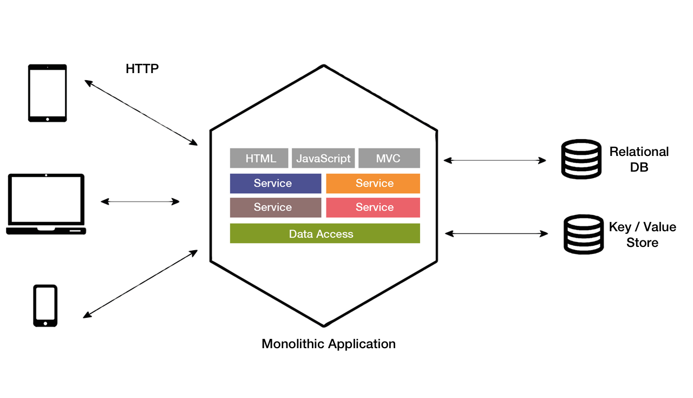

# Services

Microservices Architecture talk for Roivat Sciences. August 2018 

## About Me
William Mantly Jr.

[GitHub](https://github.com/wmantly)

[Linkedin](https://www.linkedin.com/in/wmantly/)

## Monolith vs microservices

### What is a monolithic application?

A monolithic application is self-contained, and independent from other computing applications. The design philosophy is that the application is responsible not just for a particular task, but can perform every step needed to complete a particular function, without modularity.

### What is a microservices

Microservices is an approach to application architecture and development wherein an application is built in smaller, separate pieces. Each service is developed, tested and deployed independently.

### Pros And Cons

## The bigger picture

The argument for Mirco Services or monoliths is less important in today's world of Service-oriented architectures backed by powerful Infrastructure as a service providers. Services can be easily scaled and deployed from large monoliths to single functions all with code. While we have many exciting options, we have not lost any complexity and all this comes at a price.

## Infrastructure strategies

Infrastructure may come out of a pipe these days, but it is not client ready from the tap. We still need infrastructure and operations teams to manage and get the most out of our dollars. Let us look at two infrastructure management strategies i like to call passive and active

### Passive

A Passive strategy moves most of the DevOps works to the services teams. The organization passively provides services. All teams would have to be fluent in could operations of your current provider. This will encourage a high amount of vendor lock-in making it harder to leave the current provider. A lean infrastructure team would manage access to the cloud provider. this strategy works best for highly planed apps

Pros
 * Smaller infrastructure team
 * Maybe cheaper
Cons
 * All developers are cloud fluent
 * Team manage cloud directly
 * Very high vendor lockin, Harder to move away from the cloud
 * Prone to mistakes from inexperienced users

## Active

An active strategy has the infrastructure team actively trying to abstract the cloud provider away from developers. An internal access API would be managed by an infrastructure team. A limited subset of the cloud providers services would also be abstracted and shared. The preferable way for development teams to deploy and manager projects would via repo actions triggering CD/CI functionality and the internal API. This approach would also favor more standard development tools and skills and minimize vendor lock-in.

Pros
 * Developers do not need to know about cloud providers
 * Much less access to the cloud provider
 * Minal vendor lockin
 * Higher quality control
Cons
 * Larger infrastructure team, more responsibility
 * May cost more
 

## Topics

* **Benefits** why should an organization use microservices?
* **Challenges** what should an organization keep in mind when going to microservices, particularly the “hidden challenges” from the “unknown unknowns”.
* **Development** methodologies, procedures, and processes
* **Production** operations – methods, procedures, and processes
* **Tooling** what sorts of tools exist and what sorts of tools does a microservices-focused organization need to know about
* **Staffing** are there different staffing needs (size, skills, organization) for microservices vs monolithic?

## Questions

### Why should an organization use microservices?

Using Service-oriented architecture and microservices allows organizations to respond to changes quickly and to break up concerns to the teams that they matter too.

### Does *serverless* change the calculus?

Serverless does not necessarily change the calculus, it allows for more fine-grained services while balancing the `nano service` issue.

## Developing

> *SOA is not just an architecture of services seen from a technology perspective, but the policies, practices, and frameworks by which we ensure the right services are provided and consumed.* -- MSDN[6]

> *...what is generally agreed amongst practitioners of SOA is that it is by no means a free lunch. Like many good practices in software engineering, it is an investment that will require extra planning, development, and testing.* -- ANDREW CROSIO[8]

Document exiting services

Existing API such as Data Access and REST services need to documented, clearly stating intent, access, and operations. New services need to be clearly documented in the same way prior to being put into production. Self documenting API frameworks such as Swager is a good way to keep the documentation a living document.
  
API routes are the public interface, just like any other object or class. In fact, many of the Object Oriented Desing principles apply to the application layer;

* **KISS** Keep It Simple, Stupid
* **DRY** Don’t Repeat Yourself. Prior to the development of any service, check to make sure there are no current tools or services that do some or all of your current project goals. This can be internal or external.
* **SOLID**
  * **S**  Single Responsibility Principle. An object (or service) should have one and only one responsibility. A good way of testing this is to ask "what does this do?", if you need to use the word `and`, it may do too much and should be two things.
  * **O** Open/Closed Principle. Objects or entities should be open for extension, but closed for modification. Use a service to aggregate functionality from and build upon it instead of changing existing services. This will prevent breaking changes.
  * **L** Liskov Substitution Principle.
  * **I** Interface Segregation Principle. Interfaces (Services and their API's) should be specific rather than doing many and different things.
  * **D** Dependency Inversion Principle. Do not depend directly on data sources and 3rd parties, always prefer to use a wrapper to insulated from outside changes.

Versioned API and Interfaces. Start with Version 0 for beta and move to version 1 when its ready for production. Plane for breaking changes and change the version with any breaking changes. Try not to move to version too often. Planning is important.

Containers/emulated environments

standards

templates

## Services
> *A well formed service provides us with a unit of management that relates to business usage. Enforced separation of the service provision provides us with basis for understanding the life cycle costs of a service and how it is used in the business.* -- MSDN[6]

> SOA involves the deployment of services, which are units of logic that run in a network. A service has the following characteristics:
> * It handles a business process such as calculating an insurance quote or distributing email; handles a technical task such as accessing a database; or provides business data and the technical details to construct a graphical interface.
> * It can access another service. With the appropriate runtime technology, it can access a traditional program and respond to different kinds of requesters, such as web applications.
> * It is relatively independent of other software. Changes to a requester require few or no changes to the service. Changes to the internal logic of a service require few or no changes to the requester. The relative independence of the service and other software is called loose coupling*
> -- IBM[7]

> * All teams will henceforth expose their data and functionality through service interfaces.
> * Teams must communicate with each other through these interfaces.
> * There will be no other form of inter-process communication allowed: no direct linking, no direct reads of another team’s data store, no shared-memory model, no back-doors whatsoever. The only communication allowed is via service interface calls over the network.
> * It doesn’t matter what technology they use.
> * All service interfaces, without exception, must be designed from the ground up to be externalizable. That is to say, the team must plan and design to be able to expose the interface to developers in the outside world. No exceptions.
> -- Jeff Bezos issued mandate, sometime back around 2002[11]

## Deploying

A service is a deployable unit 

## Vocabulary and Abriavation

* **Serverless**
* **SOA**
* **Monolithic Application** self-contained, and independent from other computing applications. A single-tiered application in which the UI and data access code are combined into a single program from a single platform.

## Resources
These are links I came across while writing this talk. They are in no particular order.

[1 Wiki: Microservicers](https://en.wikipedia.org/wiki/Microservices)

[2 Wiki: Service-Oriented Architecture](https://en.wikipedia.org/wiki/Service-oriented_architecture)

[3 Meduim: ASW Local tools](https://medium.com/@takezoe/how-to-develop-aws-based-application-in-the-local-environment-3e36eb705adf)

[4 Cloudingmine: Idempotence Services](http://cloudingmine.com/idempotence-what-is-it-and-why-should-i-care/)

[5 Meduim: OOD Analysis](https://medium.com/omarelgabrys-blog/object-oriented-analysis-and-design-design-principles-part-6-b78e2b9da023)

[6 MSDN: Understanding Service-Oriented Architecture](https://msdn.microsoft.com/en-us/library/aa480021.aspx)

[7 IBM: Service-Oriented Architecture](https://www.ibm.com/support/knowledgecenter/en/SSMQ79_9.5.1/com.ibm.egl.pg.doc/topics/pegl_serv_overview.html)

[8 toptal: AWS Lambda for Ultimate Service Oriented Architecture](https://www.toptal.com/aws/service-oriented-architecture-aws-lambda)

[9 AWS: Application Architecture Center](https://aws.amazon.com/architecture/)

[10 AWS: Microservices on AWS White Paper PDF](https://docs.aws.amazon.com/aws-technical-content/latest/microservices-on-aws/microservices-on-aws.pdf?icmpid=link_from_whitepapers_page)

[11 API evangelist: The Secret to Amazons Success Internal APIs](https://apievangelist.com/2012/01/12/the-secret-to-amazons-success-internal-apis/)

[12 scotch.io: S.O.L.I.D: The First 5 Principles of Object-Oriented Design](https://scotch.io/bar-talk/s-o-l-i-d-the-first-five-principles-of-object-oriented-design)

[13 ThechTarget: Learn from past mistakes to avoid Amazon lock-in](https://searchaws.techtarget.com/opinion/Learn-from-past-mistakes-to-avoid-Amazon-lock-in)

[14 Meduim: Multi-cloud, what are the options? Part 1- Low level abstraction libraries](https://medium.com/@anthonypjshaw/multi-cloud-what-are-the-options-part-1-low-level-abstraction-libraries-ce500f29120f)

[15 infoQ: Microservices From a Startup Perspective](https://www.infoq.com/articles/microservices-startup)

## Books

[Practical Object-Oriented Design in Ruby](https://www.poodr.com/)
